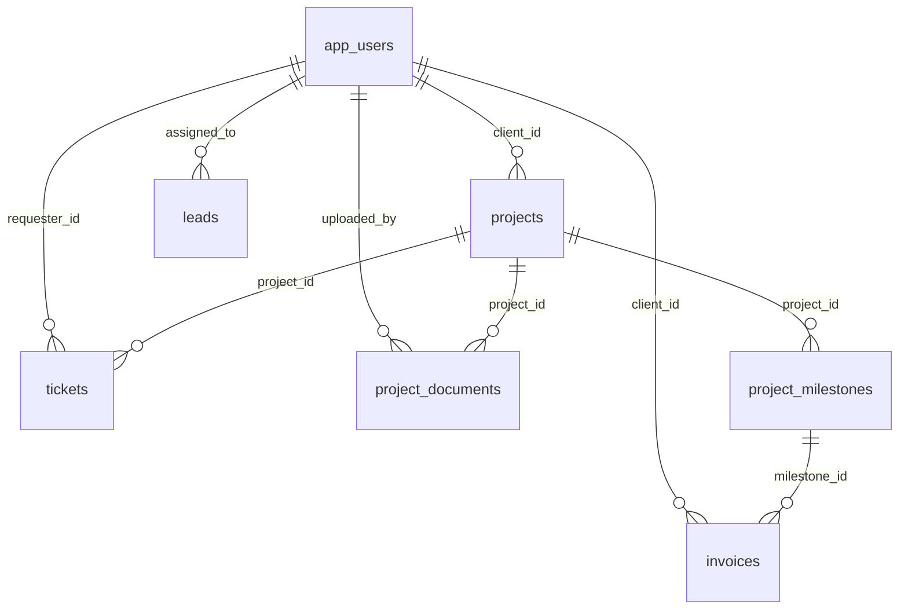

# IT Agency Website Blueprint

## Project Structure

```text
.
|-- backend
|   |-- Dockerfile
|   |-- pom.xml
|   `-- src
|       `-- main
|           |-- java/com/itagency/platform
|           |   |-- AgencyPlatformApplication.java
|           |   |-- config
|           |   |   |-- OpenApiConfig.java
|           |   |   `-- SecurityConfig.java
|           |   |-- controller
|           |   |   |-- AuthController.java
|           |   |   `-- PortfolioController.java
|           |   |-- dto
|           |   |   |-- auth
|           |   |   |   |-- AuthResponse.java
|           |   |   |   |-- LoginRequest.java
|           |   |   |   `-- RegisterRequest.java
|           |   |   |-- common
|           |   |   |   `-- ApiErrorResponse.java
|           |   |   `-- project
|           |   |       |-- ProjectCreateRequest.java
|           |   |       |-- ProjectResponse.java
|           |   |       `-- ProjectUpdateRequest.java
|           |   |-- entity
|           |   |   |-- Project.java
|           |   |   |-- ProjectStatus.java
|           |   |   |-- ProjectVisibility.java
|           |   |   |-- Role.java
|           |   |   `-- User.java
|           |   |-- exception
|           |   |   |-- GlobalExceptionHandler.java
|           |   |   `-- ResourceNotFoundException.java
|           |   |-- mapper
|           |   |   `-- ProjectMapper.java
|           |   |-- repository
|           |   |   |-- ProjectRepository.java
|           |   |   `-- UserRepository.java
|           |   |-- security
|           |   |   |-- CustomUserDetailsService.java
|           |   |   |-- JwtAuthenticationFilter.java
|           |   |   `-- JwtService.java
|           |   `-- service
|           |       |-- AuthService.java
|           |       `-- PortfolioService.java
|           `-- resources
|               |-- application.yml
|               |-- logback-spring.xml
|               `-- db/migration/V1__init_schema.sql
|-- frontend
|   |-- index.html
|   |-- package.json
|   |-- postcss.config.js
|   |-- tailwind.config.ts
|   |-- tsconfig.json
|   |-- tsconfig.node.json
|   |-- vite.config.ts
|   `-- src
|       |-- App.tsx
|       |-- index.css
|       |-- main.tsx
|       |-- api
|       |   |-- auth.ts
|       |   |-- http.ts
|       |   `-- portfolio.ts
|       |-- components
|       |   |-- navigation/SiteHeader.tsx
|       |   `-- sections/Services.tsx
|       |-- layouts
|       |   |-- AdminDashboardLayout.tsx
|       |   `-- RootLayout.tsx
|       |-- lib/queryClient.ts
|       |-- modules/auth
|       |   |-- auth-hooks.ts
|       |   `-- auth-storage.ts
|       |-- pages
|       |   |-- ClientDashboardPage.tsx
|       |   |-- HomePage.tsx
|       |   |-- LoginPage.tsx
|       |   |-- NotFoundPage.tsx
|       |   |-- RegisterPage.tsx
|       |   `-- admin/AdminOverviewPage.tsx
|       |-- router/ProtectedRoute.tsx
|       `-- types
|           |-- auth.ts
|           `-- project.ts
|-- infra
|   `-- nginx
|       |-- docker-entrypoint.d/20-select-config.sh
|       |-- templates/http.conf.template
|       |-- templates/https.conf.template
|       `-- Dockerfile
|-- .env.prod.example
|-- docker-compose.prod.yml
|-- docker-compose.yml
`-- README.md
```

## Layered Architecture

- Controller: request validation, OpenAPI annotations, HTTP response orchestration
- Service: business rules for auth, portfolio, and future CRM/dashboard workflows
- Repository: Spring Data JPA access layer
- Entity: persistence models mapped to PostgreSQL
- DTO + MapStruct: strict request/response boundaries

## Database Schema

### Main Tables

- `app_users`
  - Identity and security data
  - Stores `role`, BCrypt `password_hash`, contact/profile fields
- `projects`
  - Agency portfolio entries and private client projects
  - `visibility` determines whether a project is shown publicly
  - `client_id` links a private project to a registered client
- `service_offerings`
  - Content-managed public service cards for the marketing site
- `leads`
  - CRM intake table for website inquiries
  - Tracks `status`: `NEW`, `IN_PROGRESS`, `CLOSED`
- `tickets`
  - Support tickets for client dashboard workflows
- `project_documents`
  - Uploaded files linked to projects and end users
- `project_milestones`
  - Milestone-based delivery and billing checkpoints
- `invoices`
  - Financial reporting and PDF invoice metadata

### ERD



### SQL Notes

- UUID primary keys are used across the schema.
- PostgreSQL `pgcrypto` powers `gen_random_uuid()`.
- All mutable business records include `created_at` and `updated_at`.
- Passwords are never stored in plain text; only BCrypt hashes belong in `app_users.password_hash`.
- SQL injection is mitigated by JPA repositories and parameterized persistence access.

## Expansion Path

- Add `LeadController`, `TicketController`, and `InvoiceController` on the current service/repository pattern.
- Expose dashboard queries under `/api/v1/client/**`.
- Add S3/local file storage abstraction for `project_documents`.
- Integrate actual PDF generation service for invoices and signed contracts.
